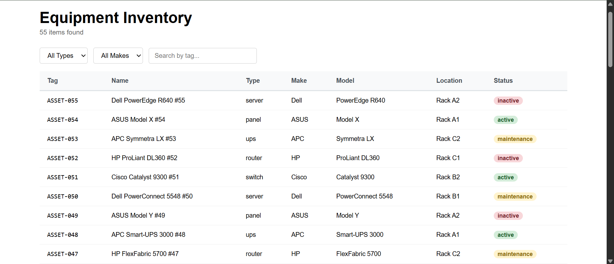

# Equipment Inventory

A fullstack equipment inventory management app built with React, Express, TypeScript, and PostgreSQL.



## Tech Stack

| Layer    | Technology                               |
| -------- | ---------------------------------------- |
| Frontend | React 18, TypeScript, Vite, React Router |
| Backend  | Node.js 18, Express, TypeScript          |
| Database | PostgreSQL 15                            |
| Testing  | Vitest, React Testing Library            |

## Project Structure

```
equipment-inventory/
├── backend/    — Express REST API
└── frontend/   — React SPA
```

## Prerequisites

- Node.js >= 18.0.0
- Docker (for PostgreSQL)

---

## Setup — Step by Step

### 1. Clone the repo

```bash
git clone https://github.com/MofakkarHM/equipment-inventory.git
cd equipment-inventory
```

### 2. Start the database

```bash
docker run --name pg-learning \
  -e POSTGRES_PASSWORD=password123 \
  -e POSTGRES_USER=admin \
  -e POSTGRES_DB=devboard \
  -p 5432:5432 \
  -d postgres:15
```

If you already have the container:

```bash
docker start pg-learning
```

### 3. Set up backend

```bash
cd backend
cp .env.example .env
```

Fill in your `.env` values:

```
PORT=3001
DB_HOST=localhost
DB_PORT=5432
DB_USER=admin
DB_PASSWORD=password123
DB_NAME=
```

Install dependencies:

```bash
npm install
```

### 4. Seed the database

```bash
npm run seed
```

Expected output:

```
✅ Database connected
✅ Table ready
✅ Done — 55 inserted, 0 skipped (already existed)
```

Running seed again is safe — duplicates are skipped automatically.

### 5. Start the backend

Development mode (auto-restart on save):

```bash
npm run dev
```

Production mode:

```bash
npm run build
npm start
```

Backend runs on http://localhost:3001

### 6. Set up and start frontend

Open a new terminal:

```bash
cd frontend
npm install
npm run dev
```

Open http://localhost:5173 in your browser.

---

## API Reference

| Method | Endpoint       | Description                       |
| ------ | -------------- | --------------------------------- |
| GET    | /health        | Health check                      |
| GET    | /equipment     | List equipment (supports filters) |
| GET    | /equipment/:id | Get single equipment item         |

### Query Parameters — GET /equipment

| Param  | Example          | Description                   |
| ------ | ---------------- | ----------------------------- |
| type   | ?type=server     | Filter by type                |
| make   | ?make=Dell       | Filter by manufacturer        |
| search | ?search=ASSET-00 | Search tag (case insensitive) |

Filters can be combined: ?type=server&make=Dell

---

## Running Tests

```bash
cd frontend
npm test
```

Expected output:

```
✓ EquipmentTable > shows loading message when loading is true
✓ EquipmentTable > shows empty state when equipment array is empty
✓ EquipmentTable > renders a row for each equipment item
✓ EquipmentTable > calls onRowClick with correct id when row is clicked
✓ EquipmentTable > renders correct status badge for each status

Test Files  1 passed (1)
Tests       5 passed (5)
```

## Running Lint

```bash
cd backend && npm run lint
cd frontend && npm run lint
```

Both must pass with 0 errors.

---

## Manual Test Checklist

### Database

- [ ] npm run seed completes with 55 rows inserted
- [ ] Running npm run seed a second time shows 55 skipped — not duplicated
- [ ] Connecting to psql and running SELECT COUNT(\*) FROM equipment returns 55

### API (backend running on port 3001)

- [ ] GET /health returns { status: "ok" }
- [ ] GET /equipment returns all 55 items
- [ ] GET /equipment?type=server returns only servers
- [ ] GET /equipment?make=Dell returns only Dell items
- [ ] GET /equipment?type=server&make=Dell returns only Dell servers
- [ ] GET /equipment?search=ASSET-00 returns matching items
- [ ] GET /equipment?type=server&type=switch returns servers only (no crash)
- [ ] GET /equipment/1 returns single item with all fields
- [ ] GET /equipment/9999 returns 404 with error message
- [ ] GET /equipment/abc returns 400 with error message
- [ ] GET /unknown-route returns 404

### Frontend (both servers running)

- [ ] localhost:5173 loads and shows 55 items in table
- [ ] Item count updates correctly when filters applied
- [ ] Filter by Type works — selecting server shows only servers
- [ ] Filter by Make works — selecting Dell shows only Dell
- [ ] Both filters work together
- [ ] Clear filters button appears when any filter is active
- [ ] Clear filters resets all three filters at once
- [ ] Search by tag filters live as you type
- [ ] Searching something with no match shows empty state
- [ ] Clicking a row navigates to detail page
- [ ] Detail page shows all fields for that item
- [ ] Date is formatted readably (e.g. January 1, 2024)
- [ ] Back button returns to list
- [ ] Visiting /equipment/9999 shows error message with back button
- [ ] Visiting /equipment/abc shows error message with back button

---

## Self-Evaluation

| Dimension        | Score (1–4) | Evidence                                              |
| ---------------- | ----------- | ----------------------------------------------------- |
| D1 Functionality | 4           | All filters, search, detail view, empty state working |
| D2 Code Quality  | 4           | No any, typed props, api/ isolated, ESLint 0 errors   |
| D3 Security      | 4           | Parameterized SQL, .env, ON CONFLICT idempotent seed  |
| D4 DX            | 4           | README with all commands, .env.example, screenshot    |
| D5 Testing       | 4           | Manual checklist + 5 RTL component tests passing      |

**Total: 20/20**
